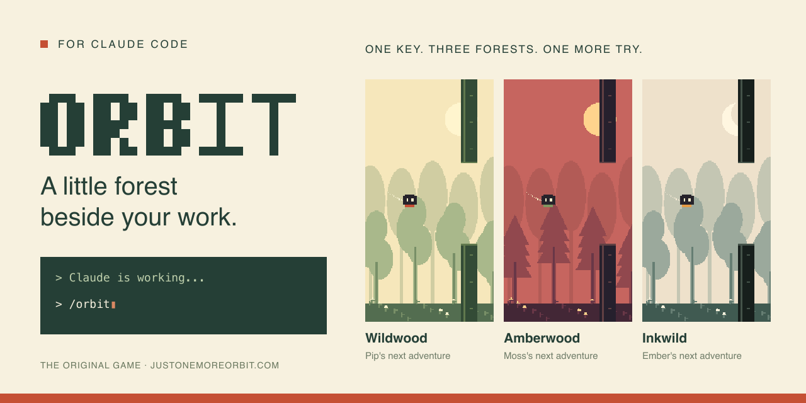
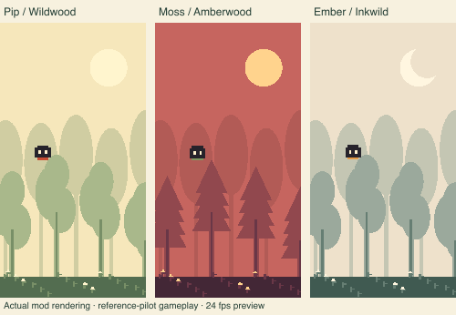

<p align="center">
  <a href="https://www.justonemoreorbit.com">
    
  </a>
</p>

<h1 align="center">ORBIT for Claude Code</h1>

<p align="center">
  <strong>Claude thinks. You find the gap.</strong><br />
  A one-key forest game in a pane beside your conversation.
</p>

<p align="center">
  <a href="https://www.justonemoreorbit.com"><strong>Play the original ORBIT ↗</strong></a>
  &nbsp; · &nbsp;
  <a href="#install">Install the mod</a>
  &nbsp; · &nbsp;
  <a href="#controls">Controls</a>
</p>

---

This is the Claude Code edition of **[ORBIT](https://www.justonemoreorbit.com)**. The original game and its home are **[justonemoreorbit.com](https://www.justonemoreorbit.com)**. This repository brings its forest, companions, movement and music into Claude Code.

One key flips your curve. Thread the gaps, keep moving, and try once more.

<p align="center">
  
  <br />
  <sub>Real game simulation and mod rendering, driven by the reference pilot. Preview animation; terminal appearance and frame rate vary.</sub>
</p>

| A small escape | What you get |
| --- | --- |
| **Three forests** | Wildwood, Amberwood and Inkwild, each with its own palette and soundtrack. |
| **Three companions** | Pip, Moss and Ember, with their original pace, orbit and weight. All available from the start. |
| **One key** | Press `f` to flip the curve. Easy to learn; the next gap still gets you. |
| **Original audio** | Bundled music, forest ambience and game effects, with separate music and sound controls. |
| **Your own best** | Saved character and forest choices, plus separate local best scores for each companion. |
| **A break when work runs long** | Opens after Claude has been working for 30 seconds. Silently, without taking your keyboard focus. |

## Install

Requires **Claude Code 2.1.291 or newer**. Run these in your terminal:

```sh
claude plugin marketplace add timgrossmann/orbit-claude-mod
claude plugin install orbit@orbit
```

Inside Claude Code:

```text
/reload-plugins
/orbit
```

Select **Play**, or press `f` while the pane has focus. The game runs alongside Claude; playing it makes no model requests.

<details>
<summary>Prefer to try a local checkout?</summary>

```sh
git clone https://github.com/timgrossmann/orbit-claude-mod.git
cd orbit-claude-mod
claude --plugin-dir .
```

Then enter `/orbit`. Use either the installed plugin or `--plugin-dir`, so you do not load two copies.

</details>

## While Claude works

Auto-open is **on by default**. If a main Claude turn lasts 30 seconds—including thinking and tool work—the game pane opens once, ready to play.

- It opens silently. Music and gameplay begin only when you press Play.
- Short, interrupted or failed turns cancel the timer.
- Closing the pane keeps it closed for the rest of that turn.
- An existing game stays as it is. The pane remains available when Claude finishes.

The preference is saved:

```text
/orbit auto off
/orbit auto on
```

`/orbit` always opens the game manually. Enabling auto-open applies to future turns.

> **Room for a forest:** Claude normally needs a terminal at least 144 columns wide to show a pane automatically, or 110 if you previously opened it and have not closed it by hand since. On narrower terminals it waits until you widen the window or enter `/orbit`.

## Controls

| Key | Action |
| --- | --- |
| `f` | Play, flip, resume or retry |
| `p` | Pause / resume |
| `r` | Retry from pause or game over |
| `c` | Choose a companion before or after a run |
| `t` | Choose a forest before or after a run |
| `m` | Music and forest ambience on / off |
| `s` | Sound effects on / off |
| `v` | Switch native pixels / cells on supported terminals |
| `Esc` | Return to Claude and pause |
| `x` | Close the game |

Click the pane to focus it, or use Claude's **Ctrl+X, then Tab** shortcut. `Enter` activates the focused button; `f` is the dependable flip key after moving between controls.

## A forest in your terminal

| Where you play | How it draws |
| --- | --- |
| **macOS Terminal and other text terminals** | Pixel art using four samples per character cell. A smaller font or larger pane gives more detail. |
| **Ghostty / kitty, outside tmux** | A native 160 × 302 pixel image. Use `v` to switch to cells. |
| **Claude Desktop, Code tab** | The same pixel artwork rendered as SVG. The host currently limits full redraws to 10 per second. |

The terminal requests a frame every 17 ms while playing. Actual speed depends on your terminal and Claude's host. The scenery stays still; the gaps move with your progress through the forest.

Audio uses Claude's native player. macOS uses `afplay`; current Linux and Windows terminal hosts skip bundled clips. Desktop audio depends on its host. The recordings are included locally, so playing needs no audio download. Pause, focus loss and closing the pane stop playback.

## Updates

In your terminal:

```sh
claude plugin update orbit@orbit
```

Then `/reload-plugins` in an open Claude session. You can also enable automatic updates for the `orbit` marketplace in Claude's plugin settings.

## Development

The mod is self-contained: no website checkout, build step or npm dependencies are required. With Node.js 22+ and Claude Code installed:

```sh
npm test             # game, rendering, audio and lifecycle regressions
npm run test:native  # terminal/Desktop controls and host integration
npm run check        # strict plugin and marketplace validation
```

`game/` contains the simulation, `render/` draws it, `audio/` manages playback, and `hooks/register.js` connects everything to Claude. `vendor/` contains ORBIT's shared game rules; `assets/audio/` holds the recordings.

Tests check behavior and requests to the host. They do not measure live terminal frame rate or confirm audible output, so test a real Claude session after changing rendering or audio.

For a release, bump the version in `.claude-plugin/plugin.json` and `package.json`, run the checks, and push to `main`.

<details>
<summary>What the mod accesses</summary>

ORBIT observes turn IDs and completion events to time automatic opening; it does not inspect prompts or answers. It uses Claude's local plugin store for settings and best scores, reads terminal identifiers to select a renderer, and asks the host to display frames and play bundled recordings.

The mod makes no model requests and calls no network, file or subprocess API itself. Claude's host loads the assets and operates its platform audio player.

</details>

---

<p align="center">
  <strong>One more gap. One more try. One more ORBIT.</strong><br /><br />
  <a href="https://www.justonemoreorbit.com">The original game lives at <strong>justonemoreorbit.com</strong> ↗</a><br />
  <sub>ORBIT by Tigr Ventures · A community mod for Claude Code; not an Anthropic product.</sub>
</p>
